<div align="center">
  

  <h1>@usex/rule-engine-builder</h1>
  <p><strong>🎨 Visual Rule Constructor for React Applications</strong></p>

  <p>
    <a href="https://www.npmjs.com/package/@usex/rule-engine-builder"></a>
    <a href="https://github.com/ali-master/rule-engine/blob/master/LICENSE"></a>
    <a href="https://www.npmjs.com/package/@usex/rule-engine-builder"></a>
    <a href="https://github.com/ali-master/rule-engine"></a>
  </p>

  <p>
    <a href="#-quick-start">Quick Start</a> •
    <a href="./docs/components.md">Components</a> •
    <a href="./docs/examples.md">Examples</a> •
    <a href="#-why-visual-builder">Why Visual Builder?</a>
  </p>
</div>

---

Create complex business rules with an intuitive drag-and-drop interface. No more JSON wrestling - build rules visually and export to your rule engine.

```typescript
// Instead of writing complex JSON...
const rule = {
  conditions: [
    {
      and: [
        { field: "$.user.tier", operator: "equals", value: "premium" },
        { field: "$.order.total", operator: "greater-than", value: 100 }
      ],
      result: { discount: 0.15, shipping: "free" }
    }
  ]
};

// Just drag, drop, and configure visually! 🎨
<RuleBuilder 
  onRuleChange={setRule}
  availableFields={fields}
  theme="dark"
/>
```

## 🚀 Why Visual Builder?

**Intuitive Visual Interface**
- 🎨 **Drag & Drop** - Build rules by dragging components onto a canvas
- 🌲 **Tree Structure** - Visual representation of complex nested logic
- 📦 **Component Palette** - Pre-built operators, fields, and logic blocks
- 🎯 **Drop Zones** - Smart targeting for precise rule construction

**Developer-Friendly Experience**
- ⚡ **Real-time Preview** - See JSON output as you build
- 🔄 **Live Evaluation** - Test rules instantly with sample data
- 📈 **History Management** - Undo/redo with 100-entry history
- ⌨️ **Keyboard Shortcuts** - Professional keyboard navigation

**Production-Ready Features**
- 🛡️ **TypeScript Native** - Full type safety and IntelliSense support
- 🎨 **Theme System** - Light/dark modes with full customization
- ♿ **Accessible** - WCAG compliant with screen reader support
- 📱 **Responsive** - Works on desktop, tablet, and mobile devices

**Extensible & Customizable**
- 🔧 **Custom Operators** - Add your own business-specific operators
- 🎛️ **Field Discovery** - Auto-suggest fields from your data schema
- 🌈 **Custom Themes** - Match your application's design system
- 📊 **Export Options** - JSON, TypeScript, or custom formats

## 🎬 Quick Start

```bash
npm install @usex/rule-engine-builder @usex/rule-engine react
```

### Basic Usage

```tsx
import React, { useState } from 'react';
import { RuleBuilder } from '@usex/rule-engine-builder';
import { RuleEngine } from '@usex/rule-engine';

function App() {
  const [rule, setRule] = useState(null);
  
  // Define available fields for your users
  const availableFields = [
    { name: '$.user.tier', type: 'string', label: 'User Tier' },
    { name: '$.user.age', type: 'number', label: 'User Age' },
    { name: '$.order.total', type: 'number', label: 'Order Total' },
    { name: '$.order.items', type: 'array', label: 'Order Items' }
  ];

  // Test data for live evaluation
  const testData = {
    user: { tier: 'premium', age: 28 },
    order: { total: 150, items: ['laptop', 'mouse'] }
  };

  return (
    <div className="app">
      <h1>Build Your Business Rules</h1>
      
      <RuleBuilder
        rule={rule}
        onRuleChange={setRule}
        availableFields={availableFields}
        testData={testData}
        theme="auto"
        showPreview={true}
        showHistory={true}
      />
      
      {rule && (
        <div className="rule-output">
          <h3>Generated Rule:</h3>
          <pre>{JSON.stringify(rule, null, 2)}</pre>
          
          <button onClick={() => testRule()}>
            Test Rule
          </button>
        </div>
      )}
    </div>
  );

  async function testRule() {
    if (!rule) return;
    
    const result = await RuleEngine.evaluate(rule, testData);
    console.log('Rule Result:', result);
  }
}
```

## 🏗️ Core Components

### RuleBuilder (Main Component)

The primary visual rule construction interface.

```tsx
<RuleBuilder
  rule={rule}                    // Current rule state
  onRuleChange={setRule}         // Callback when rule changes
  availableFields={fields}       // Available fields for selection
  testData={testData}           // Sample data for live testing
  theme="dark"                  // Theme: 'light' | 'dark' | 'auto'
  showPreview={true}            // Show JSON preview panel
  showHistory={true}            // Enable undo/redo functionality
  customOperators={operators}    // Custom business operators
  onValidationError={onError}   // Validation error callback
  className="my-rule-builder"   // Custom CSS classes
/>
```

### RuleEvaluator

Real-time rule evaluation with visual feedback.

```tsx
<RuleEvaluator
  rule={rule}
  testData={testData}
  engine={RuleEngine}
  onResult={handleResult}
  showSteps={true}              // Show evaluation steps
  highlightActive={true}        // Highlight active rule paths
/>
```

### ModernConstraintEditor

Advanced constraint editing with intelligent suggestions.

```tsx
<ModernConstraintEditor
  constraint={constraint}
  onConstraintChange={setConstraint}
  availableFields={fields}
  operators={operators}
  showFieldSuggestions={true}
  allowCustomFields={true}
/>
```

## 🔧 Component Showcase

### Building Blocks

The visual builder provides intuitive components for every rule element:

#### Logic Operators
- **AND** - All conditions must be true
- **OR** - Any condition must be true  
- **NONE** - No conditions must be true

#### Comparison Operators
- **Equals (=)** - Exact value matching
- **Greater Than (>)** - Numeric comparison
- **Contains** - Array/string inclusion
- **Matches** - Regular expression patterns

#### Field Selectors
- **JSONPath Fields** - `$.user.profile.name`
- **Nested Properties** - Deep object navigation
- **Array Elements** - `$.items[0].price`
- **Custom Fields** - User-defined properties

#### Value Inputs
- **Static Values** - Fixed strings, numbers, booleans
- **Dynamic References** - `$.other.field`
- **Arrays** - Multiple value selection
- **Date/Time** - Calendar and time pickers

## 🎯 Real-World Examples

### E-commerce Discount Builder

```tsx
function DiscountRuleBuilder() {
  const [discountRule, setDiscountRule] = useState(null);
  
  const ecommerceFields = [
    { name: '$.customer.tier', type: 'string', label: 'Customer Tier', 
      options: ['bronze', 'silver', 'gold', 'platinum'] },
    { name: '$.cart.total', type: 'number', label: 'Cart Total' },
    { name: '$.cart.itemCount', type: 'number', label: 'Number of Items' },
    { name: '$.customer.isFirstOrder', type: 'boolean', label: 'First Order' },
    { name: '$.promotions.active', type: 'array', label: 'Active Promotions' }
  ];

  const customOperators = [
    {
      name: 'is-weekend',
      label: 'Is Weekend',
      category: 'datetime',
      description: 'Check if current date is weekend'
    },
    {
      name: 'bulk-discount-eligible',
      label: 'Bulk Discount Eligible',
      category: 'business',
      description: 'Check if order qualifies for bulk pricing'
    }
  ];

  return (
    <div className="discount-builder">
      <h2>Discount Rule Builder</h2>
      
      <RuleBuilder
        rule={discountRule}
        onRuleChange={setDiscountRule}
        availableFields={ecommerceFields}
        customOperators={customOperators}
        theme="light"
        resultTemplate={{
          discount: 0,
          code: '',
          message: '',
          expires: null
        }}
      />
    </div>
  );
}
```

### User Access Control Builder

```tsx
function AccessControlBuilder() {
  const [accessRule, setAccessRule] = useState(null);
  
  const accessFields = [
    { name: '$.user.role', type: 'string', label: 'User Role' },
    { name: '$.user.department', type: 'string', label: 'Department' },
    { name: '$.user.clearanceLevel', type: 'number', label: 'Clearance Level' },
    { name: '$.resource.sensitivity', type: 'string', label: 'Resource Sensitivity' },
    { name: '$.session.duration', type: 'number', label: 'Session Duration' },
    { name: '$.time.currentHour', type: 'number', label: 'Current Hour' }
  ];

  return (
    <div className="access-builder">
      <h2>Access Control Rules</h2>
      
      <RuleBuilder
        rule={accessRule}
        onRuleChange={setAccessRule}
        availableFields={accessFields}
        theme="dark"
        showHistory={true}
        resultTemplate={{
          allowed: false,
          permissions: [],
          expires: null,
          reason: ''
        }}
      />
      
      <RuleEvaluator
        rule={accessRule}
        testData={sampleUserSession}
        showSteps={true}
        onResult={(result) => {
          console.log('Access Decision:', result);
        }}
      />
    </div>
  );
}
```

### Form Validation Builder

```tsx
function ValidationBuilder() {
  const [validationRules, setValidationRules] = useState([]);
  
  const formFields = [
    { name: 'email', type: 'string', label: 'Email Address' },
    { name: 'password', type: 'string', label: 'Password' },
    { name: 'confirmPassword', type: 'string', label: 'Confirm Password' },
    { name: 'age', type: 'number', label: 'Age' },
    { name: 'country', type: 'string', label: 'Country' },
    { name: 'acceptTerms', type: 'boolean', label: 'Accept Terms' }
  ];

  return (
    <div className="validation-builder">
      <h2>Form Validation Rules</h2>
      
      {validationRules.map((rule, index) => (
        <div key={index} className="validation-rule">
          <h3>Rule {index + 1}</h3>
          
          <RuleBuilder
            rule={rule}
            onRuleChange={(newRule) => {
              const updated = [...validationRules];
              updated[index] = newRule;
              setValidationRules(updated);
            }}
            availableFields={formFields}
            mode="validation"
            showPreview={false}
          />
        </div>
      ))}
      
      <button onClick={() => addValidationRule()}>
        Add Validation Rule
      </button>
    </div>
  );
}
```

## 🎨 Advanced Features

### Custom Themes

```tsx
const customTheme = {
  colors: {
    primary: '#6366f1',
    secondary: '#10b981',
    background: '#f8fafc',
    surface: '#ffffff',
    text: '#1f2937',
    border: '#e5e7eb'
  },
  spacing: {
    sm: '0.5rem',
    md: '1rem',
    lg: '1.5rem'
  },
  borderRadius: '0.75rem',
  shadows: {
    sm: '0 1px 2px rgba(0, 0, 0, 0.05)',
    md: '0 4px 6px rgba(0, 0, 0, 0.1)'
  }
};

<RuleBuilder
  rule={rule}
  onRuleChange={setRule}
  theme={customTheme}
  availableFields={fields}
/>
```

### Field Discovery

```tsx
// Auto-discover fields from your data schema
const fields = useFieldDiscovery(sampleData, {
  maxDepth: 3,
  includeArrays: true,
  typeInference: true
});

<RuleBuilder
  rule={rule}
  onRuleChange={setRule}
  availableFields={fields}
  allowFieldDiscovery={true}
  onFieldDiscovered={(field) => {
    console.log('New field discovered:', field);
  }}
/>
```

### History Management

```tsx
function RuleBuilderWithHistory() {
  const [rule, setRule] = useState(null);
  const { history, undo, redo, canUndo, canRedo } = useRuleHistory();

  return (
    <div>
      <div className="history-controls">
        <button 
          onClick={undo} 
          disabled={!canUndo}
          title="Undo (Ctrl+Z)"
        >
          ↶ Undo
        </button>
        
        <button 
          onClick={redo} 
          disabled={!canRedo}
          title="Redo (Ctrl+Y)"
        >
          ↷ Redo
        </button>
        
        <span className="history-count">
          Step {history.currentIndex + 1} of {history.entries.length}
        </span>
      </div>

      <RuleBuilder
        rule={rule}
        onRuleChange={setRule}
        showHistory={true}
        maxHistoryEntries={100}
      />
    </div>
  );
}
```

### Keyboard Shortcuts

The builder supports professional keyboard navigation:

| Shortcut | Action |
|----------|--------|
| `Ctrl+Z` | Undo last change |
| `Ctrl+Y` | Redo last undone change |
| `Ctrl+D` | Duplicate selected component |
| `Delete` | Remove selected component |
| `Tab` | Navigate between components |
| `Enter` | Edit selected component |
| `Escape` | Cancel current operation |
| `Ctrl+S` | Export rule (custom handler) |

## 🏎️ Performance & Optimization

### Virtual Scrolling

For large rule sets, the builder uses virtual scrolling:

```tsx
<RuleBuilder
  rule={complexRule}
  onRuleChange={setRule}
  virtualScrolling={true}
  itemHeight={60}
  maxVisibleItems={50}
/>
```

### Lazy Loading

Components are loaded on-demand for better performance:

```tsx
const LazyRuleBuilder = lazy(() => import('@usex/rule-engine-builder'));

function App() {
  return (
    <Suspense fallback={<div>Loading rule builder...</div>}>
      <LazyRuleBuilder />
    </Suspense>
  );
}
```

### Optimized Rendering

```tsx
// Use memo for expensive field calculations
const availableFields = useMemo(() => 
  generateFieldsFromSchema(schema), [schema]
);

// Debounce rule changes to reduce re-renders
const debouncedOnChange = useMemo(
  () => debounce(setRule, 300),
  []
);

<RuleBuilder
  rule={rule}
  onRuleChange={debouncedOnChange}
  availableFields={availableFields}
  optimizeRendering={true}
/>
```

## 🎓 TypeScript Support

Full type safety for all components and props:

```tsx
interface CustomField {
  name: string;
  type: 'string' | 'number' | 'boolean' | 'array' | 'object';
  label: string;
  description?: string;
  options?: string[];
  validation?: {
    required?: boolean;
    min?: number;
    max?: number;
    pattern?: string;
  };
}

interface CustomRule<T = any> {
  id: string;
  conditions: Condition<T>[];
  result?: T;
  metadata?: {
    name: string;
    description: string;
    created: Date;
    modified: Date;
  };
}

// Type-safe rule builder
const Builder = () => {
  const [rule, setRule] = useState<CustomRule<DiscountResult>>(null);
  
  return (
    <RuleBuilder<DiscountResult>
      rule={rule}
      onRuleChange={setRule}
      availableFields={typedFields}
      resultType="discount"
    />
  );
};
```

## 🧪 Testing Components

```tsx
import { render, screen, fireEvent } from '@testing-library/react';
import { RuleBuilder } from '@usex/rule-engine-builder';

describe('RuleBuilder', () => {
  const mockFields = [
    { name: 'age', type: 'number', label: 'Age' },
    { name: 'country', type: 'string', label: 'Country' }
  ];

  it('should render field palette', () => {
    render(
      <RuleBuilder
        availableFields={mockFields}
        onRuleChange={jest.fn()}
      />
    );
    
    expect(screen.getByText('Age')).toBeInTheDocument();
    expect(screen.getByText('Country')).toBeInTheDocument();
  });

  it('should handle drag and drop', () => {
    const onChange = jest.fn();
    
    render(
      <RuleBuilder
        availableFields={mockFields}
        onRuleChange={onChange}
      />
    );
    
    const ageField = screen.getByText('Age');
    const dropZone = screen.getByTestId('drop-zone');
    
    fireEvent.dragStart(ageField);
    fireEvent.drop(dropZone);
    
    expect(onChange).toHaveBeenCalledWith(
      expect.objectContaining({
        conditions: expect.arrayContaining([
          expect.objectContaining({
            field: 'age'
          })
        ])
      })
    );
  });
});
```

## 📚 Documentation & Resources

- 🏗️ **[Component Guide](./docs/components.md)** - Detailed component documentation
- 🎨 **[Theming Guide](./docs/theming.md)** - Customization and styling
- ⌨️ **[Keyboard Shortcuts](./docs/shortcuts.md)** - Complete keyboard reference
- 🔧 **[Integration Examples](./docs/integration.md)** - Framework-specific examples
- 🎯 **[Best Practices](./docs/best-practices.md)** - Performance and UX guidelines
- 📋 **[Changelog](./CHANGELOG.md)** - Version history and updates

## 🤝 Contributing

We welcome contributions! Whether it's:
- 🐛 Bug reports and fixes
- ✨ New components or features
- 📖 Documentation improvements
- 🎨 Theme contributions

See our [Contributing Guide](../../CONTRIBUTING.md) for details.

### Development Setup

```bash
# Clone the repository
git clone https://github.com/ali-master/rule-engine.git
cd rule-engine/packages/builder

# Install dependencies
pnpm install

# Start development server
pnpm dev

# Run tests
pnpm test

# Build for production
pnpm build
```

## 🆚 Why Choose This Builder?

| Feature | @usex/rule-engine-builder | React QueryBuilder | React Awesome Query Builder |
|---------|---------------------------|--------------------|-----------------------------|
| TypeScript Native | ✅ | ⚠️ Partial | ⚠️ Partial |
| Drag & Drop | ✅ | ❌ | ✅ |
| Real-time Evaluation | ✅ | ❌ | ❌ |
| History/Undo | ✅ | ❌ | ❌ |
| Custom Themes | ✅ | ⚠️ Limited | ✅ |
| Mobile Responsive | ✅ | ⚠️ Partial | ❌ |
| JSONPath Support | ✅ | ❌ | ❌ |
| Bundle Size | 45KB | 120KB | 180KB |
| Tree Visualization | ✅ | ❌ | ✅ |
| Keyboard Shortcuts | ✅ | ❌ | ❌ |

## 📄 License

MIT © [Ali Torki](https://github.com/ali-master)

---

<div align="center">

**Built with ❤️ for modern React applications**

[⭐ Star us on GitHub](https://github.com/ali-master/rule-engine) • [🐛 Report Issues](https://github.com/ali-master/rule-engine/issues) • [💬 Discussions](https://github.com/ali-master/rule-engine/discussions)

</div>