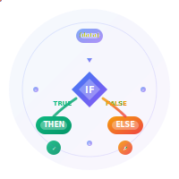

<div align="center">
  

  <h1>@usex/rule-engine</h1>
  <p><strong>🎯 The Developer's Decision Engine</strong></p>

  <p>
    <a href="https://www.npmjs.com/package/@usex/rule-engine"></a>
    <a href="https://github.com/ali-master/rule-engine/blob/master/LICENSE"></a>
    <a href="https://codecov.io/gh/ali-master/rule-engine"></a>
    <a href="https://www.npmjs.com/package/@usex/rule-engine"></a>
    <a href="https://github.com/ali-master/rule-engine"></a>
  </p>

  <p>
    <a href="#-quick-start">Quick Start</a> •
    <a href="./docs/api-reference-v2.md">API Reference</a> •
    <a href="./docs/typescript-guide.md">TypeScript Guide</a> •
    <a href="#-why-rule-engine">Why Rule Engine?</a>
  </p>
</div>

---

Transform complex business logic into elegant, maintainable JSON rules. Stop hardcoding decisions, start building intelligent systems.

```typescript
// From this mess...
if (user.tier === 'vip' && order.total > 100 && user.country === 'US') {
  return { discount: 0.20, shipping: 'free' };
} else if (user.isNew && order.total > 50) {
  return { discount: 0.10, shipping: 'standard' };
} // ... 50 more lines

// To this elegance...
const result = await RuleEngine.evaluate(discountRules, { user, order });
```

## 🚀 Why Rule Engine?

**Built for Modern Developers**
- 🎯 **Zero Dependencies** - No supply chain bloat, just pure JavaScript excellence
- 🏎️ **Lightning Fast** - 117,000+ evaluations per second
- 🛡️ **TypeScript Native** - Built-in generics for bulletproof type safety
- 🌐 **Universal** - Node.js, browsers, edge functions, Deno, Bun - everywhere JavaScript runs

**Powerful Yet Intuitive**
- 🔍 **JSONPath Support** - Navigate complex objects: `$.user.profile.settings.theme`
- 🔗 **Self-Referencing** - Dynamic field references: `"value": "$.maxPrice"`
- 🧩 **121+ Operators** - From basic comparisons to advanced pattern matching
- 🏗️ **Fluent Builder** - Construct rules programmatically with intuitive chains

**Enterprise Ready**
- 🔧 **Extensible Core** - Plugin custom operators without touching internals
- 📊 **Rule Introspection** - Reverse-engineer possible inputs from rule definitions
- ⚡ **Performance Optimized** - Optional validation bypass for trusted rules
- 🎭 **Data Mutations** - Preprocess data before evaluation

## 🎬 Quick Start

```bash
npm install @usex/rule-engine
```

### Your First Rule in 30 Seconds

```typescript
import { RuleEngine } from '@usex/rule-engine';

// Define a discount rule
const discountRule = {
  conditions: [
    {
      // VIP customers get 20% off orders over $100
      and: [
        { field: "$.customer.tier", operator: "equals", value: "vip" },
        { field: "$.order.total", operator: "greater-than", value: 100 }
      ],
      result: { discount: 0.20, message: "VIP discount applied! 🎉" }
    },
    {
      // First-time buyers get 10% off orders over $50
      and: [
        { field: "$.customer.orderCount", operator: "equals", value: 0 },
        { field: "$.order.total", operator: "greater-than", value: 50 }
      ],
      result: { discount: 0.10, message: "Welcome! First order discount 🎁" }
    }
  ],
  default: { discount: 0, message: "No discount available" }
};

// Apply the rule
const orderData = {
  customer: { tier: "vip", orderCount: 5 },
  order: { total: 150, items: ["laptop", "mouse"] }
};

const result = await RuleEngine.evaluate(discountRule, orderData);
console.log(result);
// { value: { discount: 0.20, message: "VIP discount applied! 🎉" }, isPassed: true }
```

## 🏗️ Core Concepts

### Rules Structure
Every rule follows this pattern:
```typescript
interface Rule<T = any> {
  conditions: Condition<T> | Condition<T>[];  // What to check
  default?: T;                                // Fallback result
}
```

### Conditions: Your Logic Building Blocks
```typescript
interface Condition<T = any> {
  and?: Array<Constraint | Condition<T>>;   // ALL must match
  or?: Array<Constraint | Condition<T>>;    // ANY must match
  none?: Array<Constraint | Condition<T>>;  // NONE must match
  result?: T;                               // What to return when matched
}
```

### Constraints: The Evaluation Units
```typescript
interface Constraint {
  field: string;      // Path to the data (supports JSONPath)
  operator: string;   // How to compare
  value: any;         // What to compare against
  message?: string;   // Optional validation message
}
```

## 🛠️ API Reference

### Static Methods (Recommended)

| Method | Description | Returns |
|--------|-------------|---------|
| `RuleEngine.evaluate(rule, data, trustRule?)` | Full evaluation with metadata | `Promise<EvaluationResult<T>>` |
| `RuleEngine.checkIsPassed(rule, data, trustRule?)` | Quick boolean check | `Promise<boolean>` |
| `RuleEngine.getEvaluateResult(rule, data, trustRule?)` | Just the result value | `Promise<T>` |
| `RuleEngine.evaluateMany(rules, data, trustRule?)` | Batch evaluation | `Promise<EvaluationResult<T>[]>` |
| `RuleEngine.validate(rule)` | Validate rule structure | `ValidationResult` |
| `RuleEngine.introspect(rule)` | Analyze rule requirements | `IntrospectionResult` |
| `RuleEngine.builder()` | Get fluent builder | `RuleBuilder` |

### Instance Methods
```typescript
const engine = new RuleEngine();
// All static methods available as instance methods
await engine.evaluate(rule, data);
```

## 🔧 Operators Showcase

### String & Text
```typescript
// Basic string operations
{ field: "name", operator: "equals", value: "John" }
{ field: "email", operator: "like", value: "*@gmail.com" }
{ field: "description", operator: "matches", value: "^Product.*" }

// Validation
{ field: "email", operator: "email", value: true }
{ field: "url", operator: "url", value: true }
{ field: "uuid", operator: "uuid", value: true }
```

### Numbers & Ranges
```typescript
// Comparisons
{ field: "age", operator: "greater-than", value: 18 }
{ field: "price", operator: "between", value: [10, 100] }

// Types
{ field: "score", operator: "integer", value: true }
{ field: "rating", operator: "positive", value: true }
```

### Arrays & Collections
```typescript
// Membership
{ field: "roles", operator: "contains", value: "admin" }
{ field: "status", operator: "in", value: ["active", "pending"] }
{ field: "tags", operator: "contains-all", value: ["urgent", "review"] }
{ field: "features", operator: "contains-any", value: ["premium", "beta"] }
```

### Date & Time
```typescript
// Date comparisons
{ field: "birthDate", operator: "date-after", value: "1990-01-01" }
{ field: "expiryDate", operator: "date-before-now", value: true }
{ field: "createdAt", operator: "date-between", value: ["2023-01-01", "2023-12-31"] }

// Time comparisons
{ field: "openTime", operator: "time-after", value: "09:00" }
{ field: "closeTime", operator: "time-before", value: "17:30" }
```

### Existence & Nullability
```typescript
// Existence checks
{ field: "optional", operator: "exists", value: true }
{ field: "deprecated", operator: "not-exists", value: true }

// Null checks
{ field: "data", operator: "null-or-undefined", value: false }
{ field: "config", operator: "not-empty", value: true }
```

### Length & Size
```typescript
// String length
{ field: "password", operator: "min-length", value: 8 }
{ field: "username", operator: "max-length", value: 20 }
{ field: "code", operator: "string-length", value: 6 }
{ field: "description", operator: "length-between", value: [10, 500] }
```

## 🎯 Real-World Examples

### 🛒 E-commerce Pricing Engine
```typescript
const pricingRules = {
  conditions: [
    {
      // Black Friday: 50% off everything
      and: [
        { field: "$.event.name", operator: "equals", value: "black-friday" },
        { field: "$.event.active", operator: "equals", value: true }
      ],
      result: {
        discount: 0.50,
        code: "BLACKFRIDAY50",
        expires: "2025-11-30T23:59:59Z"
      }
    },
    {
      // Bulk orders: tiered discounts
      or: [
        { field: "$.cart.quantity", operator: "greater-than", value: 50 },
        { field: "$.cart.value", operator: "greater-than", value: 1000 }
      ],
      result: {
        discount: 0.15,
        code: "BULK15",
        shipping: "free"
      }
    },
    {
      // New customer welcome
      and: [
        { field: "$.customer.orderHistory.length", operator: "equals", value: 0 },
        { field: "$.cart.value", operator: "greater-than", value: 50 }
      ],
      result: {
        discount: 0.10,
        code: "WELCOME10",
        message: "Welcome! Enjoy 10% off your first order 🎉"
      }
    }
  ],
  default: { discount: 0, message: "Regular pricing applies" }
};
```

### 🔐 Dynamic Access Control
```typescript
const accessControlRules = {
  conditions: [
    {
      // Super admin: full access
      and: [
        { field: "role", operator: "equals", value: "super-admin" },
        { field: "status", operator: "equals", value: "active" }
      ],
      result: {
        permissions: ["read", "write", "delete", "admin"],
        level: "unlimited",
        expires: null
      }
    },
    {
      // Department manager: departmental access
      and: [
        { field: "role", operator: "equals", value: "manager" },
        { field: "department", operator: "exists", value: true },
        { field: "$.session.loginTime", operator: "date-after-now", value: "-8h" }
      ],
      result: {
        permissions: ["read", "write"],
        level: "department",
        scope: "$.department",
        expires: "$.session.loginTime + 8h"
      }
    },
    {
      // Regular user: read-only during business hours
      and: [
        { field: "role", operator: "equals", value: "user" },
        { field: "$.currentTime", operator: "time-between", value: ["09:00", "17:00"] },
        { field: "$.currentTime", operator: "date-between", value: ["monday", "friday"] }
      ],
      result: {
        permissions: ["read"],
        level: "limited",
        expires: "17:00"
      }
    }
  ],
  default: {
    permissions: [],
    level: "none",
    message: "Access denied"
  }
};
```

### ✅ Smart Form Validation
```typescript
const registrationValidation = {
  conditions: {
    and: [
      // Email validation with custom message
      {
        field: "email",
        operator: "email",
        value: true,
        message: "Please enter a valid email address"
      },

      // Strong password requirements
      {
        and: [
          {
            field: "password",
            operator: "min-length",
            value: 8,
            message: "Password must be at least 8 characters long"
          },
          {
            field: "password",
            operator: "matches",
            value: ".*[A-Z].*",
            message: "Password must contain at least one uppercase letter"
          },
          {
            field: "password",
            operator: "matches",
            value: ".*[0-9].*",
            message: "Password must contain at least one number"
          }
        ]
      },

      // Age verification
      {
        field: "birthDate",
        operator: "date-before",
        value: "$.today - 18 years",
        message: "You must be 18 or older to register"
      },

      // Terms acceptance
      {
        field: "acceptTerms",
        operator: "equals",
        value: true,
        message: "You must accept our terms and conditions"
      },

      // Optional referral code validation
      {
        or: [
          { field: "referralCode", operator: "not-exists", value: true },
          { field: "referralCode", operator: "empty", value: true },
          {
            and: [
              { field: "referralCode", operator: "string-length", value: 8 },
              { field: "referralCode", operator: "alpha-numeric", value: true }
            ]
          }
        ],
        message: "Referral code must be 8 alphanumeric characters"
      }
    ]
  }
};
```

## 🎨 Advanced Features

### 🔗 Self-Referencing Magic
Compare fields against other fields dynamically:

```typescript
const budgetRule = {
  conditions: {
    and: [
      // Actual cost must not exceed budget
      {
        field: "$.project.actualCost",
        operator: "less-than-or-equals",
        value: "$.project.approvedBudget"
      },
      // Start date must be before end date
      {
        field: "$.project.startDate",
        operator: "date-before",
        value: "$.project.endDate"
      },
      // Team size appropriate for project scope
      {
        field: "$.project.teamSize",
        operator: "greater-than-or-equals",
        value: "$.project.minimumTeamSize"
      }
    ]
  }
};
```

### 🏗️ Fluent Builder Pattern
Construct complex rules programmatically:

```typescript
const complexRule = RuleEngine.builder()
  .add({
    and: [
      { field: "userType", operator: "equals", value: "premium" },
      { field: "subscriptionActive", operator: "equals", value: true }
    ],
    result: { access: "premium", features: ["analytics", "api", "support"] }
  })
  .add({
    and: [
      { field: "userType", operator: "equals", value: "basic" },
      { field: "trialExpired", operator: "equals", value: false }
    ],
    result: { access: "basic", features: ["dashboard"] }
  })
  .default({ access: "none", features: [] })
  .build(true); // Validate during build
```

### 🔧 Custom Operators (V2)
Extend the engine with your own operators:

```typescript
import { registerCustomOperator, OperatorCategory, BaseOperatorStrategy } from '@usex/rule-engine';

class CreditCardOperator extends BaseOperatorStrategy<string, void> {
  readonly metadata = {
    name: "credit-card",
    displayName: "Credit Card Number",
    category: OperatorCategory.PATTERN,
    description: "Validates credit card numbers using Luhn algorithm",
    acceptedFieldTypes: ["string"],
    expectedValueType: "void",
    requiresValue: false,
  };

  evaluate(context) {
    const { fieldValue } = context;
    return this.isValidCreditCard(fieldValue);
  }

  private isValidCreditCard(cardNumber: string): boolean {
    // Luhn algorithm implementation
    const digits = cardNumber.replace(/\D/g, '');
    let sum = 0;
    let isEven = false;

    for (let i = digits.length - 1; i >= 0; i--) {
      let digit = parseInt(digits[i]);

      if (isEven) {
        digit *= 2;
        if (digit > 9) digit -= 9;
      }

      sum += digit;
      isEven = !isEven;
    }

    return sum % 10 === 0;
  }
}

// Register and use
registerCustomOperator(CreditCardOperator);

const paymentRule = {
  conditions: {
    and: [
      { field: "cardNumber", operator: "credit-card" },
      { field: "cvv", operator: "string-length", value: 3 }
    ]
  }
};
```

### 🎭 Data Mutations
Preprocess data before evaluation:

```typescript
const engine = new RuleEngine();

// Add mutations for data preprocessing
engine.addMutation('normalizeEmail', (data) => {
  if (data.email) {
    data.email = data.email.toLowerCase().trim();
  }
  return data;
});

engine.addMutation('calculateAge', (data) => {
  if (data.birthDate) {
    const today = new Date();
    const birth = new Date(data.birthDate);
    data.age = today.getFullYear() - birth.getFullYear();
  }
  return data;
});

// Mutations are applied automatically before evaluation
const result = await engine.evaluate(rule, {
  email: "  USER@EXAMPLE.COM  ",
  birthDate: "1990-01-01"
});
```

### 📊 Rule Introspection
Understand what your rules need:

```typescript
const insights = RuleEngine.introspect(complexRule);
console.log(insights);
// {
//   fields: ["userType", "subscriptionActive", "trialExpired"],
//   operators: ["equals"],
//   possibleResults: [
//     { access: "premium", features: ["analytics", "api", "support"] },
//     { access: "basic", features: ["dashboard"] },
//     { access: "none", features: [] }
//   ],
//   complexity: "medium",
//   estimatedPerformance: "fast"
// }
```

## 🏎️ Performance & Optimization

### Benchmarks
| Operation | Records | Time | Throughput |
|-----------|---------|------|------------|
| Simple Rule (3 conditions) | 10,000 | 85ms | ~117,000/sec |
| Complex Rule (15+ conditions) | 10,000 | 250ms | ~40,000/sec |
| JSONPath Resolution | 10,000 | 120ms | ~83,000/sec |
| With Mutations | 10,000 | 150ms | ~66,000/sec |
| Custom Operators | 10,000 | 180ms | ~55,000/sec |

### Optimization Tips

**1. Trust Mode for Validated Rules**
```typescript
// Skip validation for 20% performance boost
const result = await RuleEngine.evaluate(rule, data, true);
```

**2. Reuse Engine Instances**
```typescript
const engine = new RuleEngine();
// Reuse for better performance with mutations
```

**3. Batch Processing**
```typescript
// Process multiple records at once
const results = await RuleEngine.evaluate(rule, arrayOfData);
```

**4. Operator Selection**
```typescript
// Prefer specific operators over general ones
{ operator: "equals" }        // ✅ Fast
{ operator: "matches" }       // ⚠️ Slower for simple cases
```

## 🎓 TypeScript Support

Full type safety with intelligent inference:

```typescript
interface UserPermissions {
  canRead: boolean;
  canWrite: boolean;
  canDelete: boolean;
  level: 'admin' | 'user' | 'guest';
}

// Type-safe rule definition
const accessRule: Rule<UserPermissions> = {
  conditions: [
    {
      and: [
        { field: "role", operator: "equals", value: "admin" },
        { field: "active", operator: "equals", value: true }
      ],
      result: {
        canRead: true,
        canWrite: true,
        canDelete: true,
        level: "admin"
      }
    }
  ],
  default: {
    canRead: false,
    canWrite: false,
    canDelete: false,
    level: "guest"
  }
};

// Type-safe evaluation
const result = await RuleEngine.evaluate<UserPermissions>(accessRule, userData);
// result.value is typed as UserPermissions ✅
```

### Generic Builder Pattern
```typescript
const typedRule = RuleEngine.builder<UserPermissions>()
  .add({
    and: [{ field: "role", operator: "equals", value: "admin" }],
    result: { canRead: true, canWrite: true, canDelete: true, level: "admin" }
  })
  .default({ canRead: false, canWrite: false, canDelete: false, level: "guest" })
  .build();
```

## 🧪 Testing Your Rules

```typescript
import { describe, it, expect } from 'vitest';
import { RuleEngine } from '@usex/rule-engine';

describe('Discount Rules', () => {
  it('should apply VIP discount for qualifying orders', async () => {
    const result = await RuleEngine.evaluate(discountRule, {
      customer: { tier: 'vip', orderCount: 5 },
      order: { total: 150 }
    });

    expect(result.isPassed).toBe(true);
    expect(result.value.discount).toBe(0.20);
    expect(result.value.message).toContain('VIP');
  });

  it('should validate rule structure', () => {
    const validation = RuleEngine.validate(discountRule);
    expect(validation.isValid).toBe(true);
    expect(validation.errors).toHaveLength(0);
  });

  it('should handle edge cases gracefully', async () => {
    const result = await RuleEngine.evaluate(discountRule, {});
    expect(result.value).toEqual({ discount: 0, message: "No discount available" });
  });
});
```

## 📚 Documentation & Resources

- 📖 **[TypeScript Guide](./docs/typescript-guide.md)** - Advanced TypeScript patterns and best practices
- 🔧 **[API Reference](./docs/api-reference-v2.md)** - Complete method documentation with examples
- 🚀 **[Migration Guide](./docs/v2-migration-guide.md)** - Upgrading from v1 to v2
- 🎯 **[Operators Reference](./docs/operators.md)** - Complete list of all 121+ operators
- 💡 **[Best Practices](./docs/best-practices.md)** - Patterns for maintainable rule systems
- 📋 **[Changelog](./CHANGELOG.md)** - Detailed version history

## 🤝 Contributing

We love contributions! Whether it's:
- 🐛 Bug reports and fixes
- ✨ New operators or features
- 📖 Documentation improvements
- 🎨 Examples and tutorials

See our [Contributing Guide](../../CONTRIBUTING.md) for details.

### Development Setup
```bash
# Clone and setup
git clone https://github.com/ali-master/rule-engine.git
cd rule-engine
pnpm install

# Run tests
pnpm test

# Run benchmarks
pnpm test:bench

# Build package
pnpm build

# Watch mode for development
pnpm dev
```

## 🆚 Why Choose this lib Over Alternatives?

| Feature | @usex/rule-engine | json-rules-engine | node-rules |
|---------|-------------------|-------------------|------------|
| Zero Dependencies | ✅ | ❌ | ❌ |
| TypeScript Native | ✅ | ⚠️ Partial | ❌ |
| JSONPath Support | ✅ | ❌ | ❌ |
| Self-Referencing | ✅ | ❌ | ❌ |
| Custom Operators | ✅ | ⚠️ Limited | ❌ |
| Performance (ops/sec) | 117k+ | 45k | 30k |
| Bundle Size | 12KB | 45KB | 38KB |
| Browser Support | ✅ | ✅ | ❌ |
| Rule Introspection | ✅ | ❌ | ❌ |
| Fluent Builder | ✅ | ❌ | ❌ |

## 📄 License

MIT © [Ali Torki](https://github.com/ali-master)

---

<div align="center">

**Built with ❤️ by [Ali Torki](https://github.com/ali-master), for developers**

[⭐ Star us on GitHub](https://github.com/ali-master/rule-engine) • [🐛 Report Issues](https://github.com/ali-master/rule-engine/issues) • [💬 Discussions](https://github.com/ali-master/rule-engine/discussions)

</div>
